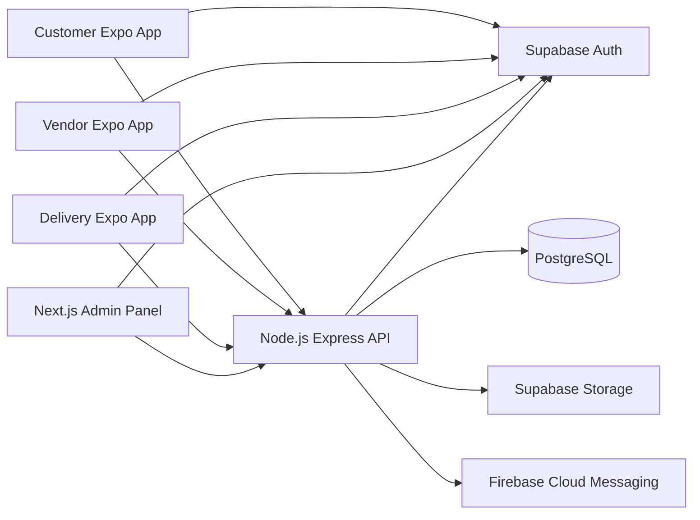

# Sonman Architecture

## Overview

Sonman is structured as a monorepo with four user-facing applications and one
shared backend service. Client applications authenticate with Supabase Auth and
call the backend for business operations. The backend owns privileged access to
PostgreSQL, Supabase Storage, and Firebase Cloud Messaging.



## Repository Layout

```text
sonman/
|-- apps/
|   |-- customer-app/
|   |-- vendor-app/
|   |-- delivery-app/
|   `-- admin-panel/
|-- services/
|   `-- backend/
|-- docs/
|-- package.json
|-- pnpm-workspace.yaml
`-- tsconfig.base.json
```

## Application Boundaries

| Component | Responsibilities |
| --- | --- |
| Customer app | Customer account, discovery, ordering, and order status |
| Vendor app | Vendor account, catalog management, and order fulfillment |
| Delivery app | Delivery partner account, assignment, and delivery status |
| Admin panel | Administrative workflows, support, and platform oversight |
| Backend | Business rules, data access, integrations, and privileged operations |

## Data and Identity

- PostgreSQL is the system of record for relational business data.
- Supabase Auth manages identities and authentication tokens.
- Clients receive publishable Supabase configuration only.
- The backend validates user identity before performing business operations.
- The Supabase service role key remains server-side and must never be exposed to
  applications.

## File Storage

Supabase Storage is used for uploaded assets such as profile images and catalog
media. Storage access rules should be defined before uploads are implemented.
Privileged storage operations belong in the backend.

## Notifications

Firebase Cloud Messaging delivers push notifications to mobile applications.
Device token registration, token rotation, and notification preferences should
be implemented through backend APIs. Firebase server credentials remain
server-side.

## Deferred Decisions

The following details should be decided during implementation:

- PostgreSQL migration tooling and schema ownership
- API route conventions and versioning
- Shared package boundaries
- Deployment targets and continuous delivery workflows
- Observability and error reporting providers
