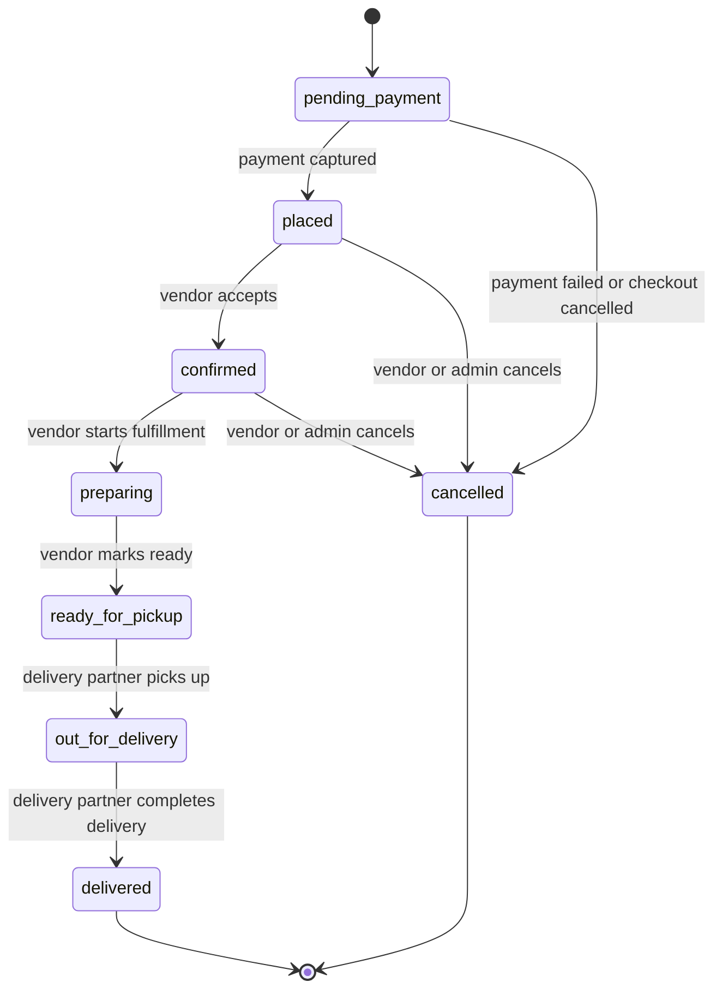

# Sonman Database Schema

## Scope

This document describes the initial PostgreSQL data model for Sonman. It is a
design reference for the migrations in `supabase/migrations`. The migrations
create the initial tables, PostgreSQL enums, row-level security policies,
triggers, and storage buckets.

Conventions:

- Primary keys use `uuid`.
- Timestamps use `timestamptz`.
- Monetary values use `numeric(12,2)` and store a three-letter currency code.
- Quantities use `integer` unless fractional inventory becomes a requirement.
- Mutable tables include `created_at` and `updated_at`.
- Soft deletion uses `deleted_at` where historical records or references must
  remain intact.
- `users.id` matches the corresponding Supabase Auth user identifier.

## Identity and Profiles

### `users`

Application profile shared by every authenticated actor. Supabase Auth remains
the source of truth for credentials and authentication state.

| Column | Type | Constraints | Notes |
| --- | --- | --- | --- |
| `id` | `uuid` | Primary key | Matches Supabase Auth user ID |
| `role` | `text` | Not null | `customer`, `vendor`, `delivery_partner`, or `admin` |
| `email` | `text` | Not null, unique | Normalized email for application use |
| `phone` | `text` | Unique | Optional normalized phone number |
| `full_name` | `text` | Not null | Display name |
| `avatar_path` | `text` | | Supabase Storage object path |
| `is_active` | `boolean` | Not null, default `true` | Administrative access switch |
| `created_at` | `timestamptz` | Not null, default `now()` | |
| `updated_at` | `timestamptz` | Not null, default `now()` | |

Indexes:

- Unique index on `lower(email)`.
- Partial index on `role` where `is_active = true`.

### `customers`

Customer-specific profile data.

| Column | Type | Constraints | Notes |
| --- | --- | --- | --- |
| `id` | `uuid` | Primary key | |
| `user_id` | `uuid` | Not null, unique, foreign key -> `users.id` | |
| `default_address` | `jsonb` | | Structured delivery address |
| `created_at` | `timestamptz` | Not null, default `now()` | |
| `updated_at` | `timestamptz` | Not null, default `now()` | |

Indexes:

- Unique index on `user_id`.

### `vendors`

Vendor business profile and operational state.

| Column | Type | Constraints | Notes |
| --- | --- | --- | --- |
| `id` | `uuid` | Primary key | |
| `user_id` | `uuid` | Not null, unique, foreign key -> `users.id` | Owner account |
| `business_name` | `text` | Not null | |
| `description` | `text` | | |
| `business_address` | `jsonb` | Not null | |
| `approval_status` | `text` | Not null, default `pending` | `pending`, `approved`, `rejected`, or `suspended` |
| `is_open` | `boolean` | Not null, default `false` | Whether new orders may be accepted |
| `created_at` | `timestamptz` | Not null, default `now()` | |
| `updated_at` | `timestamptz` | Not null, default `now()` | |

Indexes:

- Unique index on `user_id`.
- Index on `(approval_status, is_open)`.
- Index on `lower(business_name)`.

### `delivery_partners`

Delivery partner profile and availability.

| Column | Type | Constraints | Notes |
| --- | --- | --- | --- |
| `id` | `uuid` | Primary key | |
| `user_id` | `uuid` | Not null, unique, foreign key -> `users.id` | |
| `vehicle_type` | `text` | | Such as `bike`, `scooter`, or `car` |
| `vehicle_number` | `text` | | |
| `approval_status` | `text` | Not null, default `pending` | `pending`, `approved`, `rejected`, or `suspended` |
| `availability_status` | `text` | Not null, default `offline` | `offline`, `available`, or `busy` |
| `created_at` | `timestamptz` | Not null, default `now()` | |
| `updated_at` | `timestamptz` | Not null, default `now()` | |

Indexes:

- Unique index on `user_id`.
- Index on `(approval_status, availability_status)`.

## Catalog and Inventory

### `categories`

Hierarchical product categories managed by administrators.

| Column | Type | Constraints | Notes |
| --- | --- | --- | --- |
| `id` | `uuid` | Primary key | |
| `parent_id` | `uuid` | Foreign key -> `categories.id` | Null for a root category |
| `name` | `text` | Not null | |
| `slug` | `text` | Not null, unique | URL-safe identifier |
| `description` | `text` | | |
| `is_active` | `boolean` | Not null, default `true` | |
| `sort_order` | `integer` | Not null, default `0` | |
| `created_at` | `timestamptz` | Not null, default `now()` | |
| `updated_at` | `timestamptz` | Not null, default `now()` | |

Indexes:

- Unique index on `slug`.
- Index on `(parent_id, sort_order)`.
- Index on `is_active`.

### `products`

Vendor-owned product catalog entries.

| Column | Type | Constraints | Notes |
| --- | --- | --- | --- |
| `id` | `uuid` | Primary key | |
| `vendor_id` | `uuid` | Not null, foreign key -> `vendors.id` | |
| `category_id` | `uuid` | Not null, foreign key -> `categories.id` | |
| `name` | `text` | Not null | |
| `slug` | `text` | Not null | Unique within a vendor |
| `description` | `text` | | |
| `price` | `numeric(12,2)` | Not null, check `price >= 0` | |
| `currency` | `char(3)` | Not null | ISO 4217 code |
| `delivery_size` | `text` | Not null, default `small` | `small`, `medium`, `large`, or `heavy` |
| `is_active` | `boolean` | Not null, default `true` | |
| `deleted_at` | `timestamptz` | | Soft deletion timestamp |
| `created_at` | `timestamptz` | Not null, default `now()` | |
| `updated_at` | `timestamptz` | Not null, default `now()` | |

Indexes:

- Unique index on `(vendor_id, slug)` where `deleted_at is null`.
- Index on `(vendor_id, is_active)` where `deleted_at is null`.
- Index on `(category_id, is_active)` where `deleted_at is null`.
- Full-text or trigram search index on `name` and `description` when search is
  implemented.

### `product_images`

Ordered product media stored in Supabase Storage.

| Column | Type | Constraints | Notes |
| --- | --- | --- | --- |
| `id` | `uuid` | Primary key | |
| `product_id` | `uuid` | Not null, foreign key -> `products.id` | |
| `storage_path` | `text` | Not null | Supabase Storage object path |
| `alt_text` | `text` | | |
| `sort_order` | `integer` | Not null, default `0` | |
| `is_primary` | `boolean` | Not null, default `false` | |
| `created_at` | `timestamptz` | Not null, default `now()` | |

Indexes:

- Index on `(product_id, sort_order)`.
- Partial unique index on `product_id` where `is_primary = true`.

### `inventory`

Current stock state for each product.

| Column | Type | Constraints | Notes |
| --- | --- | --- | --- |
| `id` | `uuid` | Primary key | |
| `product_id` | `uuid` | Not null, unique, foreign key -> `products.id` | |
| `quantity_available` | `integer` | Not null, default `0`, check `>= 0` | Sellable units |
| `quantity_reserved` | `integer` | Not null, default `0`, check `>= 0` | Units held during checkout |
| `low_stock_threshold` | `integer` | Not null, default `0`, check `>= 0` | |
| `updated_at` | `timestamptz` | Not null, default `now()` | |

Indexes:

- Unique index on `product_id`.
- Index on `quantity_available`.

## Cart and Checkout

### `carts`

Active or completed customer shopping carts. A cart belongs to one vendor so an
order can be fulfilled and delivered as one unit.

| Column | Type | Constraints | Notes |
| --- | --- | --- | --- |
| `id` | `uuid` | Primary key | |
| `customer_id` | `uuid` | Not null, foreign key -> `customers.id` | |
| `vendor_id` | `uuid` | Not null, foreign key -> `vendors.id` | |
| `status` | `text` | Not null, default `active` | `active`, `converted`, or `abandoned` |
| `created_at` | `timestamptz` | Not null, default `now()` | |
| `updated_at` | `timestamptz` | Not null, default `now()` | |

Indexes:

- Partial unique index on `customer_id` where `status = 'active'`.
- Index on `(vendor_id, status)`.

### `cart_items`

Products currently selected in a cart.

| Column | Type | Constraints | Notes |
| --- | --- | --- | --- |
| `id` | `uuid` | Primary key | |
| `cart_id` | `uuid` | Not null, foreign key -> `carts.id` | |
| `product_id` | `uuid` | Not null, foreign key -> `products.id` | |
| `quantity` | `integer` | Not null, check `quantity > 0` | |
| `created_at` | `timestamptz` | Not null, default `now()` | |
| `updated_at` | `timestamptz` | Not null, default `now()` | |

Indexes:

- Unique index on `(cart_id, product_id)`.
- Index on `product_id`.

## Orders and Payments

### `orders`

Customer order with pricing and delivery snapshots captured at checkout.

| Column | Type | Constraints | Notes |
| --- | --- | --- | --- |
| `id` | `uuid` | Primary key | |
| `order_number` | `text` | Not null, unique | Customer-visible identifier |
| `customer_id` | `uuid` | Not null, foreign key -> `customers.id` | |
| `vendor_id` | `uuid` | Not null, foreign key -> `vendors.id` | |
| `cart_id` | `uuid` | Unique, foreign key -> `carts.id` | Source cart |
| `status` | `text` | Not null, default `pending_payment` | See order status flow |
| `currency` | `char(3)` | Not null | ISO 4217 code |
| `subtotal_amount` | `numeric(12,2)` | Not null, check `>= 0` | |
| `delivery_fee_amount` | `numeric(12,2)` | Not null, default `0`, check `>= 0` | |
| `delivery_zone` | `text` | Not null, default `A` | `A` for 0-10 km, `B` for over 10-30 km, or `C` for over 30 km |
| `delivery_distance_km` | `numeric(8,2)` | Not null, default `0`, check `>= 0` | Checkout distance snapshot |
| `expected_delivery_date` | `date` | Not null | Next day before 6 PM IST, otherwise within two days |
| `delivery_quote_required` | `boolean` | Not null, default `false` | True when Sonman must confirm the delivery fee before dispatch |
| `delivery_fee_overridden` | `boolean` | Not null, default `false` | True after an admin sets the delivery fee |
| `discount_amount` | `numeric(12,2)` | Not null, default `0`, check `>= 0` | |
| `total_amount` | `numeric(12,2)` | Not null, check `>= 0` | |
| `delivery_address` | `jsonb` | Not null | Snapshot of checkout address |
| `payment_method` | `text` | Not null, default `online` | Prepaid online payment only |
| `payment_status` | `text` | Not null, default `pending` | Order-level payment summary |
| `cancellation_allowed_until_status` | `text` | Not null, default `pending` | Cancellation closes after order confirmation |
| `replacement_eligible` | `boolean` | Not null, default `true` | Replacement may be requested for an eligible delivery issue |
| `replacement_reported_at` | `timestamptz` | | Delivery-time issue report timestamp |
| `policy_acknowledged_at` | `timestamptz` | Not null | Customer prepaid-policy acknowledgement |
| `customer_notes` | `text` | | |
| `placed_at` | `timestamptz` | | |
| `cancelled_at` | `timestamptz` | | |
| `delivered_at` | `timestamptz` | | |
| `created_at` | `timestamptz` | Not null, default `now()` | |
| `updated_at` | `timestamptz` | Not null, default `now()` | |

Indexes:

- Unique index on `order_number`.
- Index on `(customer_id, created_at desc)`.
- Index on `(vendor_id, status, created_at desc)`.
- Index on `(status, created_at)`.

### `order_items`

Immutable product and price snapshots for an order.

| Column | Type | Constraints | Notes |
| --- | --- | --- | --- |
| `id` | `uuid` | Primary key | |
| `order_id` | `uuid` | Not null, foreign key -> `orders.id` | |
| `product_id` | `uuid` | Not null, foreign key -> `products.id` | Historical reference |
| `product_name` | `text` | Not null | Product name snapshot |
| `unit_price` | `numeric(12,2)` | Not null, check `>= 0` | |
| `quantity` | `integer` | Not null, check `quantity > 0` | |
| `line_total` | `numeric(12,2)` | Not null, check `>= 0` | |
| `delivery_size` | `text` | Not null, default `small` | Product delivery-size snapshot |
| `created_at` | `timestamptz` | Not null, default `now()` | |

Indexes:

- Index on `order_id`.
- Index on `product_id`.

### `payments`

Payment attempts and provider reconciliation details. An order may have
multiple attempts.

| Column | Type | Constraints | Notes |
| --- | --- | --- | --- |
| `id` | `uuid` | Primary key | |
| `order_id` | `uuid` | Not null, foreign key -> `orders.id` | |
| `provider` | `text` | Not null | Payment provider identifier |
| `provider_payment_id` | `text` | | Provider-side transaction ID |
| `status` | `text` | Not null, default `pending` | `pending`, `authorized`, `captured`, `failed`, `cancelled`, or `refunded` |
| `amount` | `numeric(12,2)` | Not null, check `amount >= 0` | |
| `currency` | `char(3)` | Not null | ISO 4217 code |
| `failure_reason` | `text` | | |
| `metadata` | `jsonb` | Not null, default `{}` | Non-sensitive provider metadata |
| `paid_at` | `timestamptz` | | |
| `created_at` | `timestamptz` | Not null, default `now()` | |
| `updated_at` | `timestamptz` | Not null, default `now()` | |

Indexes:

- Index on `(order_id, created_at desc)`.
- Unique index on `(provider, provider_payment_id)` where
  `provider_payment_id is not null`.
- Index on `status`.

## Fulfillment and Engagement

### `delivery_assignments`

Delivery assignment lifecycle for an order. Reassignment creates a new record
so assignment history remains available.

| Column | Type | Constraints | Notes |
| --- | --- | --- | --- |
| `id` | `uuid` | Primary key | |
| `order_id` | `uuid` | Not null, foreign key -> `orders.id` | |
| `delivery_partner_id` | `uuid` | Not null, foreign key -> `delivery_partners.id` | |
| `status` | `text` | Not null, default `assigned` | `assigned`, `accepted`, `picked_up`, `delivered`, `rejected`, or `cancelled` |
| `assigned_at` | `timestamptz` | Not null, default `now()` | |
| `accepted_at` | `timestamptz` | | |
| `picked_up_at` | `timestamptz` | | |
| `delivered_at` | `timestamptz` | | |
| `created_at` | `timestamptz` | Not null, default `now()` | |
| `updated_at` | `timestamptz` | Not null, default `now()` | |

Indexes:

- Index on `(order_id, created_at desc)`.
- Index on `(delivery_partner_id, status, assigned_at desc)`.
- Partial unique index on `order_id` where `status in ('assigned', 'accepted',
  'picked_up')`.

### `reviews`

Customer review of an ordered product. Only verified purchases should be
accepted.

| Column | Type | Constraints | Notes |
| --- | --- | --- | --- |
| `id` | `uuid` | Primary key | |
| `customer_id` | `uuid` | Not null, foreign key -> `customers.id` | |
| `order_item_id` | `uuid` | Not null, unique, foreign key -> `order_items.id` | Verifies purchase |
| `product_id` | `uuid` | Not null, foreign key -> `products.id` | Query convenience |
| `rating` | `smallint` | Not null, check `rating between 1 and 5` | |
| `comment` | `text` | | |
| `is_visible` | `boolean` | Not null, default `true` | Moderation state |
| `created_at` | `timestamptz` | Not null, default `now()` | |
| `updated_at` | `timestamptz` | Not null, default `now()` | |

Indexes:

- Unique index on `order_item_id`.
- Index on `(product_id, is_visible, created_at desc)`.
- Index on `(customer_id, created_at desc)`.

### `notifications`

In-app notification log. Push delivery may be attempted through Firebase Cloud
Messaging after a record is created.

| Column | Type | Constraints | Notes |
| --- | --- | --- | --- |
| `id` | `uuid` | Primary key | |
| `user_id` | `uuid` | Not null, foreign key -> `users.id` | Recipient |
| `type` | `text` | Not null | Application-defined event type |
| `title` | `text` | Not null | |
| `body` | `text` | Not null | |
| `data` | `jsonb` | Not null, default `{}` | Client routing and context |
| `channel` | `text` | Not null, default `in_app` | `in_app`, `push`, or `both` |
| `delivery_status` | `text` | Not null, default `pending` | `pending`, `sent`, or `failed` |
| `read_at` | `timestamptz` | | |
| `sent_at` | `timestamptz` | | |
| `created_at` | `timestamptz` | Not null, default `now()` | |

Indexes:

- Index on `(user_id, created_at desc)`.
- Partial index on `(user_id, created_at desc)` where `read_at is null`.
- Index on `(delivery_status, created_at)`.

### `ai_product_enhancements`

Tracks generated product content proposals and their review state. Generated
content is not published directly to `products`.

| Column | Type | Constraints | Notes |
| --- | --- | --- | --- |
| `id` | `uuid` | Primary key | |
| `product_id` | `uuid` | Not null, foreign key -> `products.id` | |
| `requested_by_user_id` | `uuid` | Not null, foreign key -> `users.id` | |
| `enhancement_type` | `text` | Not null | Such as `description`, `title`, or `tags` |
| `source_content` | `jsonb` | Not null | Input snapshot used for generation |
| `generated_content` | `jsonb` | | Proposed output |
| `status` | `text` | Not null, default `pending` | `pending`, `completed`, `failed`, `approved`, or `rejected` |
| `model` | `text` | | Model identifier for auditability |
| `error_message` | `text` | | |
| `reviewed_by_user_id` | `uuid` | Foreign key -> `users.id` | Vendor owner or admin |
| `reviewed_at` | `timestamptz` | | |
| `created_at` | `timestamptz` | Not null, default `now()` | |
| `updated_at` | `timestamptz` | Not null, default `now()` | |

Indexes:

- Index on `(product_id, created_at desc)`.
- Index on `(requested_by_user_id, created_at desc)`.
- Index on `(status, created_at)`.

## Order Status Flow

The backend owns order transitions and records the matching timestamps. Clients
request actions; they do not set arbitrary status values.

Allowed `orders.status` values:

| Status | Meaning |
| --- | --- |
| `pending_payment` | Order draft exists while payment is incomplete |
| `placed` | Payment succeeded and the vendor may accept the order |
| `confirmed` | Vendor accepted the order |
| `preparing` | Vendor is preparing the items |
| `ready_for_pickup` | Order is waiting for collection |
| `out_for_delivery` | Delivery partner collected the order |
| `delivered` | Delivery completed |
| `cancelled` | Order will not be fulfilled |

Refund handling should be represented through `payments.status`. If operational
reporting later needs explicit refund progress on the order, add a separate
fulfillment-independent payment summary rather than overloading order status.

## Role-Based Access Notes

Authorization is enforced by the backend after validating Supabase Auth tokens.
If Supabase database APIs are exposed directly later, equivalent PostgreSQL row
level security policies are required. The Supabase service role key bypasses row
level security and must remain server-side.

| Role | Access notes |
| --- | --- |
| Customer | Read and update own profile, manage own active cart, place orders, view own orders and payments, submit reviews for delivered purchased items, and read own notifications |
| Vendor | Read and update own vendor profile, manage own products, images, and inventory, read orders for own vendor account, update allowed fulfillment states, request or review AI enhancements for own products, and read own notifications |
| Delivery partner | Read and update own delivery profile and availability, view assigned deliveries, update allowed assignment and delivery states, and read own notifications |
| Admin | Manage categories, approve or suspend vendors and delivery partners, inspect platform records, moderate reviews, and perform support operations |

Additional rules:

- Public catalog queries expose only active products from approved vendors and
  active categories.
- Product image storage paths may be public or signed according to the bucket
  policy. Upload and deletion permissions remain restricted.
- `order_items`, order pricing snapshots, captured payments, and completed
  delivery assignments are append-only from ordinary user workflows.
- Vendor users may access only records connected to their `vendors.id`.
- Delivery partners may access only their active or historical assignments.
- AI-generated content requires vendor or admin review before product fields are
  updated.
- Administrative actions should be audited when support workflows are
  implemented.

## Deferred Implementation Decisions

- Production migration deployment ownership
- PostgreSQL enum types versus check constraints for lifecycle states
- Address normalization and whether reusable addresses need a dedicated table
- Inventory reservation timeout and release mechanism
- Payment provider selection and webhook idempotency strategy
- Device token storage for Firebase Cloud Messaging
- Audit log table and retention policy
